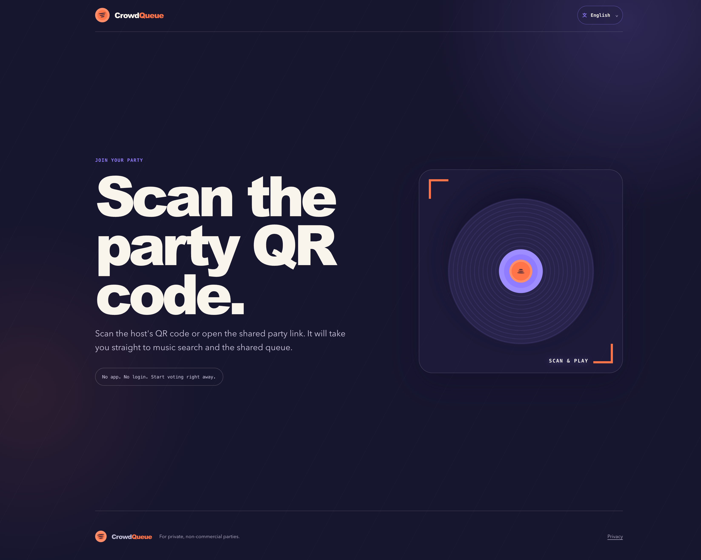
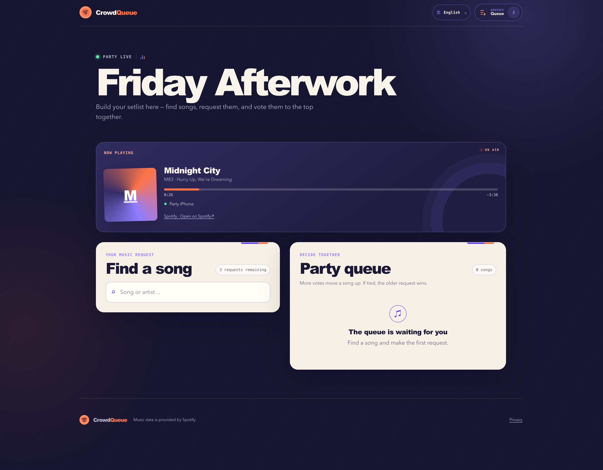
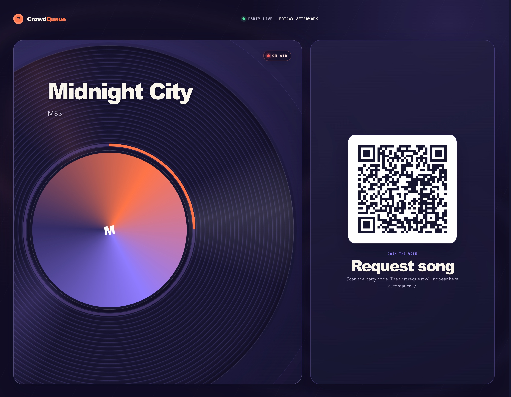
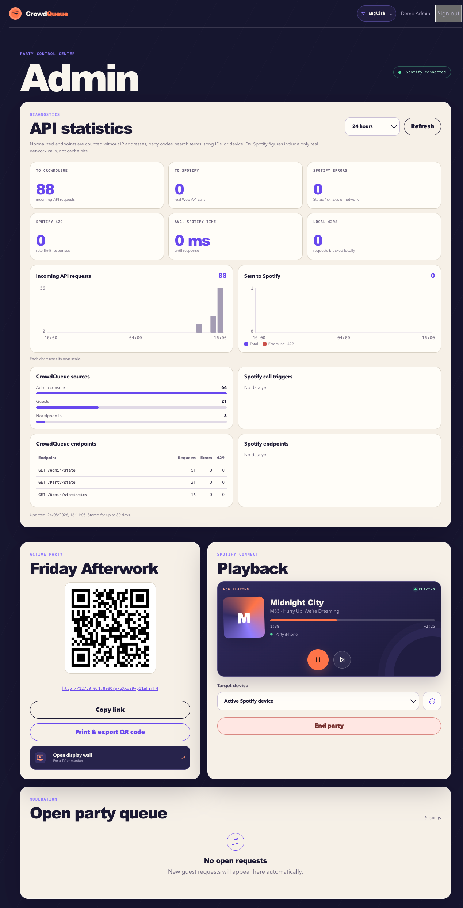

# CrowdQueue

Self-hosted, mobile-first party queue for Spotify Connect. Guests join through a QR code without an account, request songs, and vote on the order while playback remains under the host's Spotify account.

[Deutsch](#deutsch) · [English](#english) · [MIT License](./LICENSE)

## Screenshots

### Startseite und Gastansicht / Landing page and guest view

<p align="center">
  
  
</p>

### Display Wall



### Adminbereich / Admin console

<p align="center">
  
</p>

---

## Deutsch

### Überblick

CrowdQueue ist eine selbst gehostete Web-App für private Feiern. Der Host verbindet ein Spotify-Premium-Konto und wählt ein Spotify-Connect-Gerät. Gäste öffnen den Party-Link oder scannen den QR-Code, suchen Songs und stimmen gemeinsam über die Reihenfolge ab. Es ist keine Installation und kein Gast-Login erforderlich.

Die Anwendung verwaltet eine eigene votierbare Party Queue. Etwa 30 Sekunden vor dem Ende des laufenden Titels wird der Gewinner fest eingeplant und an die native Spotify-Warteschlange übergeben.

### Funktionen

- Mobile Gastansicht ohne Registrierung oder App-Installation
- Spotify-Suche, Musikwünsche und gemeinsame Abstimmungen
- Maximal drei eigene offene Musikwünsche pro Gerät
- Schutz vor Eigenvotes und mehrfachen Stimmen
- Live-Aktualisierung über Server-Sent Events mit Polling-Fallback
- Anzeige des aktuellen und des fest eingeplanten nächsten Titels
- Schreibgeschützte Ansicht der nativen Spotify-Warteschlange
- Spotify-Wiedergabesteuerung und Geräteauswahl im Adminbereich
- Display Wall für Fernseher und Monitore mit aktuellem Titel, kommenden Wünschen und Gast-QR-Code
- QR-Export als hochauflösendes PNG, A4-Plakat oder Kartenbogen mit 2, 4, 6, 8, 9 oder 12 Karten
- Farbige und tonerarme Schwarzweiß-Druckvorlagen; die PDF-Erzeugung erfolgt lokal im Browser
- Aggregierte API-Statistik für 1 Stunde, 24 Stunden, 7 Tage oder 30 Tage
- Oberfläche auf Deutsch und Englisch mit Browser-Erkennung und gespeichertem Sprachumschalter
- Persistente Spotify-Rate-Limit-Behandlung mit `Retry-After` und exponentiellem Backoff
- Responsive Oberfläche für Smartphones, Tablets und Desktop-Browser

### Voraussetzungen

- Docker mit Compose
- Spotify Premium für das Host-Konto
- Eine Spotify-Web-API-Anwendung im [Spotify Developer Dashboard](https://developer.spotify.com/dashboard)
- Für den öffentlichen Betrieb eine HTTPS-Adresse, üblicherweise über einen Reverse Proxy wie Caddy
- Für die lokale Entwicklung Node.js 24 oder neuer

### Schnellstart mit Docker

1. Repository klonen und in das Projektverzeichnis wechseln.
2. `.env.example` als `.env` kopieren.
3. Basis-URLs, Spotify-Zugangsdaten und alle Secrets eintragen.
4. Im Spotify Developer Dashboard `SPOTIFY_REDIRECT_URI` exakt als Redirect URI hinterlegen.
5. Container bauen und starten.
6. `/admin` öffnen, das einmalige Setup-Token eingeben und Spotify verbinden.

```sh
git clone https://github.com/daranto/CrowdQueue.git
cd CrowdQueue
cp .env.example .env
chmod 600 .env
docker compose up -d --build
```

Secrets lassen sich beispielsweise so erzeugen:

```sh
openssl rand -base64 48
```

In Produktion müssen `SESSION_SECRET`, `ENCRYPTION_KEY` und `HEALTHCHECK_TOKEN` mindestens 32 Zeichen sowie `ADMIN_SETUP_TOKEN` mindestens 24 Zeichen lang sein. `DEMO_MODE=true` wird in Produktion absichtlich abgewiesen.

### Konfiguration

| Variable | Beschreibung |
| --- | --- |
| `PORT` | HTTP-Port der Anwendung, standardmäßig `8080` |
| `PUBLIC_BASE_URL` | Öffentliche HTTPS-Basis-URL für über das Internet erreichbare Gast-Links |
| `LAN_BASE_URL` | Basis-URL für Gast-Links im lokalen Netzwerk |
| `TRUST_PROXY` | Vertrauenswürdige Proxy-IP oder eng begrenzte Netze, zum Beispiel `loopback,linklocal,uniquelocal` |
| `SPOTIFY_CLIENT_ID` | Client ID der Spotify-Web-API-Anwendung |
| `SPOTIFY_CLIENT_SECRET` | Client Secret der Spotify-Web-API-Anwendung |
| `SPOTIFY_REDIRECT_URI` | Exakte OAuth-Callback-URL, zum Beispiel `https://party.example.com/api/admin/spotify/callback` |
| `SESSION_SECRET` | Signiert Sitzungs- und Geräte-Cookies |
| `ENCRYPTION_KEY` | Verschlüsselt gespeicherte Spotify-Tokens |
| `HEALTHCHECK_TOKEN` | Schützt `/healthz` über `Authorization: Bearer …` |
| `ADMIN_SETUP_TOKEN` | Nur für die erste Verbindung des Besitzerkontos erforderlich |
| `DEMO_MODE` | Aktiviert lokale Demo-Daten; ausschließlich für Entwicklung und Tests |
| `LOCK_BEFORE_END_MS` | Vorlauf zum Festschreiben des nächsten Songs, standardmäßig `30000` ms |
| `GUEST_SPOTIFY_REQUESTS_PER_MINUTE` | Gemeinsames Minutenbudget für nicht gecachte Spotify-Aufrufe von Gästen, standardmäßig `20` |
| `DATABASE_PATH` | Pfad zur SQLite-Datenbank; im Container `/data/crowdqueue.sqlite` |

Spotify verlangt für OAuth HTTPS. Nur explizite Loopback-Adressen wie `http://127.0.0.1:<port>` sind für lokale Entwicklung erlaubt; `localhost` wird nicht akzeptiert.

### Bedienung und Seiten

| Pfad | Zweck |
| --- | --- |
| `/` | Startseite mit Hinweis zum Beitritt über einen Party-QR-Code |
| `/admin` | Spotify-Verbindung, Party-Erstellung, Wiedergabe, Geräte, QR-Export, Moderation und Statistik |
| `/p/<code>` | Mobile Gastansicht einer Party |
| `/p/<code>/display` | Display Wall für Fernseher oder Monitor |
| `/datenschutz` | Integrierte Datenschutzhinweise |

Eine Party wird beim Erstellen entweder an `PUBLIC_BASE_URL` oder `LAN_BASE_URL` gebunden. Der erzeugte QR-Code verwendet genau diese Adresse.

Der erste erfolgreich verbundene Spotify-Account wird dauerhaft als Besitzer festgelegt. Spätere Admin-Anmeldungen müssen dasselbe Konto verwenden. Für einen bewussten Besitzerwechsel muss das Daten-Volume zurückgesetzt oder `owner_account_id` kontrolliert in der SQLite-Datenbank entfernt werden.

### Aktualisieren

Vor einem Update sollte das Docker-Volume gesichert werden. Ohne den ursprünglichen `ENCRYPTION_KEY` kann die gespeicherte Spotify-Verbindung aus einem Backup nicht wiederhergestellt werden.

```sh
git pull --ff-only
docker compose up -d --build
```

Installationen aus älteren Versionen benötigen in Produktion ein gesetztes `HEALTHCHECK_TOKEN`. Fehlt ein gültiges Token, verweigert der Server den Produktionsstart.

### Reverse Proxy und Caddy

[`Caddyfile.example`](./Caddyfile.example) enthält Beispiele für eine öffentliche Domain und einen internen WLAN-Hostnamen. Hinter einem Reverse Proxy sollte `TRUST_PROXY` auf dessen exakte IP oder ein enges privates Netz beschränkt werden. Der Anwendungsport sollte öffentlich nicht zusätzlich direkt freigegeben werden.

Bei vorgeschaltetem Cloudflare sollten mindestens „Always Use HTTPS“, HSTS und TLS 1.2 aktiviert sein. Der Origin-Port darf nur für Caddy beziehungsweise den Tunnel erreichbar sein. Optional kann `/healthz` am öffentlichen Proxy vollständig blockiert werden; der interne Docker-Healthcheck bleibt davon unberührt.

### Lokale Entwicklung

Abhängigkeiten installieren und API sowie Frontend in zwei Terminals starten:

```sh
npm ci
DEMO_MODE=true npm run dev
```

```sh
npm run dev:client
```

- Frontend: `http://127.0.0.1:5173`
- API: `http://127.0.0.1:8080`
- Adminbereich: `http://127.0.0.1:5173/admin`

Im Demo-Modus ist keine Spotify-Konfiguration nötig. Der Admin-Login führt unmittelbar in die Oberfläche und stellt Beispieldaten bereit.

### Qualitätssicherung

```sh
npm run typecheck
npm run lint
npm test
npm run build
npm run test:e2e
```

Die End-to-End-Tests verwenden Playwright mit mobilen WebKit- und Chromium-Profilen.

### Betrieb, Sicherheit und Datenschutz

- SQLite verwendet WAL und liegt im Docker-Volume unter `/data/crowdqueue.sqlite`.
- Der Container läuft ohne Root-Rechte, mit schreibgeschütztem Root-Dateisystem und schreibt nur nach `/data`.
- Admin-Schreibzugriffe sind durch Sitzung, CSRF-Prüfung und sichere Cookie-Einstellungen geschützt.
- Spotify Refresh-Tokens werden verschlüsselt gespeichert; Secrets gehören ausschließlich in `.env`.
- `/healthz` prüft Server und Datenbank, benötigt aber den korrekten Bearer-Token. Ungültige öffentliche Aufrufe erhalten 404.
- IP-Adressen werden nicht im Klartext gespeichert. Für die Missbrauchsbegrenzung wird nur ein täglich begrenzter kryptografischer Prüfwert verwendet.
- API-Statistiken speichern ausschließlich minutenweise Summen, keine IP-Adressen, Party-Codes, Suchbegriffe, Song- oder Geräte-IDs.
- Beendete Partys und nicht mehr benötigte Spotify-Metadaten werden nach sieben Tagen entfernt.
- Aggregierte API-Statistiken bleiben maximal 30 Tage erhalten.
- Eine Rotation des Spotify Refresh-Tokens verlängert dessen ursprüngliche Sechsmonatsfrist nicht. Bei `invalid_grant` bleibt der Besitzer erhalten und kann Spotify ohne Setup-Token erneut verbinden.

### Grenzen von Spotify

Spotify erlaubt das Lesen und Anhängen an die native Playback Queue, aber kein freies Entfernen oder Umsortieren. CrowdQueue verwaltet deshalb eine eigene sortierbare Queue und übergibt ungefähr 30 Sekunden vor Songende genau einen Gewinner an Spotify. Ein bereits fest eingeplanter Titel kann technisch nicht mehr zurückgeholt werden.

CrowdQueue verwendet adaptives Polling und mehrere Caches, um das Spotify-Kontingent zu schonen. Admin- und Controller-Aufrufe werden vor wartenden Gastsuchen ausgeführt. Bei `429 Too Many Requests` wird die Sperre zentral in SQLite gespeichert; bis zu ihrem Ablauf werden keine weiteren Spotify-Anfragen gesendet. Bereits vorhandene Wünsche und Votes bleiben weiterhin verfügbar.

CrowdQueue ist für private, nicht kommerzielle Feiern gedacht. Spotify Premium und die [Spotify Developer Policy](https://developer.spotify.com/policy) sind einzuhalten.

### KI-Unterstützung, Haftung und Lizenz

CrowdQueue wurde mit Unterstützung generativer KI entwickelt. Teile des Quellcodes, der Tests und der Dokumentation wurden mithilfe von KI erstellt oder überarbeitet. KI-generierte Beiträge können trotz Prüfung Fehler, Sicherheitslücken oder unvollständige Annahmen enthalten.

Die Software wird in der vorliegenden Form („as is“) ohne ausdrückliche oder stillschweigende Gewährleistung bereitgestellt. Die Nutzung erfolgt auf eigenes Risiko. Soweit gesetzlich zulässig, übernehmen die Urheber und Rechteinhaber keine Haftung für Ansprüche, Schäden oder andere Folgen, die aus der Software oder ihrer Nutzung entstehen. Maßgeblich ist der vollständige Haftungs- und Gewährleistungsausschluss in der [`LICENSE`](./LICENSE).

Der von diesem Projekt stammende Quellcode und die Projektdokumentation stehen, sofern nicht anders angegeben, unter der [MIT-Lizenz](./LICENSE). Sie erlaubt auch private und kommerzielle Nutzung, Änderung und Weitergabe unter Beibehaltung des Copyright- und Lizenzhinweises. Abhängigkeiten behalten ihre jeweiligen Lizenzen. Spotify, Spotify Connect, Spotify-Inhalte und -Marken sowie Drittinhalte wie Albumcover sind nicht Bestandteil der MIT-Lizenz dieses Projekts; für sie gelten die Bedingungen und Rechte der jeweiligen Anbieter und Rechteinhaber. Wer CrowdQueue mit der Spotify-Plattform betreibt, ist zusätzlich selbst für die Einhaltung der [Spotify Developer Terms](https://developer.spotify.com/terms), der Developer Policy und der dort geforderten Endnutzer- und Datenschutzhinweise verantwortlich.

---

## English

### Overview

CrowdQueue is a self-hosted web app for private parties. The host connects a Spotify Premium account and selects a Spotify Connect device. Guests open the party link or scan its QR code, search for songs, and vote on the order together. No installation or guest account is required.

The application maintains its own votable party queue. About 30 seconds before the current track ends, the winner is locked in and appended to Spotify's native playback queue.

### Features

- Mobile guest experience without registration or app installation
- Spotify search, music requests, and collaborative voting
- Up to three open requests per guest device
- Protection against self-votes and duplicate votes
- Live updates through Server-Sent Events with a polling fallback
- Current-track and locked-next-track presentation
- Read-only view of Spotify's native queue
- Spotify playback controls and device selection in the admin console
- Display Wall for TVs and monitors with the current track, upcoming requests, and guest QR code
- QR export as a high-resolution PNG, A4 poster, or card sheet with 2, 4, 6, 8, 9, or 12 cards
- Color and toner-saving monochrome print templates, generated locally in the browser
- Aggregated API statistics for 1 hour, 24 hours, 7 days, or 30 days
- German and English interface with browser detection and a persistent language switcher
- Persistent Spotify rate-limit handling with `Retry-After` and exponential backoff
- Responsive interface for phones, tablets, and desktop browsers

### Requirements

- Docker with Compose
- Spotify Premium for the host account
- A Spotify Web API application in the [Spotify Developer Dashboard](https://developer.spotify.com/dashboard)
- An HTTPS address for public use, typically provided by a reverse proxy such as Caddy
- Node.js 24 or newer for local development

### Docker quick start

1. Clone the repository and enter the project directory.
2. Copy `.env.example` to `.env`.
3. Configure the base URLs, Spotify credentials, and all secrets.
4. Add the exact `SPOTIFY_REDIRECT_URI` value as a redirect URI in the Spotify Developer Dashboard.
5. Build and start the container.
6. Open `/admin`, enter the one-time setup token, and connect Spotify.

```sh
git clone https://github.com/daranto/CrowdQueue.git
cd CrowdQueue
cp .env.example .env
chmod 600 .env
docker compose up -d --build
```

Secrets can be generated with:

```sh
openssl rand -base64 48
```

In production, `SESSION_SECRET`, `ENCRYPTION_KEY`, and `HEALTHCHECK_TOKEN` must contain at least 32 characters, while `ADMIN_SETUP_TOKEN` must contain at least 24. Production deliberately rejects `DEMO_MODE=true`.

### Configuration

| Variable | Description |
| --- | --- |
| `PORT` | Application HTTP port, default `8080` |
| `PUBLIC_BASE_URL` | Public HTTPS base URL used for internet-facing guest links |
| `LAN_BASE_URL` | Base URL used for guest links on the local network |
| `TRUST_PROXY` | Trusted proxy IP or narrowly scoped networks, for example `loopback,linklocal,uniquelocal` |
| `SPOTIFY_CLIENT_ID` | Client ID of the Spotify Web API application |
| `SPOTIFY_CLIENT_SECRET` | Client secret of the Spotify Web API application |
| `SPOTIFY_REDIRECT_URI` | Exact OAuth callback URL, for example `https://party.example.com/api/admin/spotify/callback` |
| `SESSION_SECRET` | Signs session and device cookies |
| `ENCRYPTION_KEY` | Encrypts stored Spotify tokens |
| `HEALTHCHECK_TOKEN` | Protects `/healthz` through `Authorization: Bearer …` |
| `ADMIN_SETUP_TOKEN` | Required only for the first owner-account connection |
| `DEMO_MODE` | Enables local demo data; development and testing only |
| `LOCK_BEFORE_END_MS` | Lead time for locking the next song, default `30000` ms |
| `GUEST_SPOTIFY_REQUESTS_PER_MINUTE` | Shared per-minute budget for uncached guest Spotify calls, default `20` |
| `DATABASE_PATH` | SQLite database path; `/data/crowdqueue.sqlite` inside the container |

Spotify requires HTTPS for OAuth. Only explicit loopback addresses such as `http://127.0.0.1:<port>` are allowed for local development; `localhost` is rejected.

### Pages and operation

| Path | Purpose |
| --- | --- |
| `/` | Landing page explaining how to join through a party QR code |
| `/admin` | Spotify connection, party creation, playback, devices, QR export, moderation, and statistics |
| `/p/<code>` | Mobile guest view for a party |
| `/p/<code>/display` | Display Wall for a TV or monitor |
| `/datenschutz` | Built-in privacy information |

When a party is created, it is bound to either `PUBLIC_BASE_URL` or `LAN_BASE_URL`. The generated QR code uses that exact address.

The first Spotify account connected successfully becomes the permanent owner. Later admin sessions must use the same account. To intentionally change the owner, reset the data volume or carefully remove `owner_account_id` from the SQLite database.

### Updating

Back up the Docker volume before updating. A saved Spotify connection cannot be restored from a backup without the original `ENCRYPTION_KEY`.

```sh
git pull --ff-only
docker compose up -d --build
```

Production installations upgrading from older versions must configure `HEALTHCHECK_TOKEN`. The server refuses to start in production when a valid token is missing.

### Reverse proxy and Caddy

[`Caddyfile.example`](./Caddyfile.example) contains examples for a public domain and an internal Wi-Fi hostname. Behind a reverse proxy, restrict `TRUST_PROXY` to its exact IP or a narrow private network. Do not expose the application port directly to the public internet as well.

When Cloudflare is placed in front of the server, enable at least Always Use HTTPS, HSTS, and TLS 1.2. The origin port should be reachable only by Caddy or the tunnel. `/healthz` may optionally be blocked completely at the public proxy without affecting Docker's internal health check.

### Local development

Install dependencies and run the API and frontend in two terminals:

```sh
npm ci
DEMO_MODE=true npm run dev
```

```sh
npm run dev:client
```

- Frontend: `http://127.0.0.1:5173`
- API: `http://127.0.0.1:8080`
- Admin console: `http://127.0.0.1:5173/admin`

Demo mode does not require Spotify configuration. The admin login opens the interface immediately and supplies sample data.

### Quality checks

```sh
npm run typecheck
npm run lint
npm test
npm run build
npm run test:e2e
```

The end-to-end suite uses Playwright with mobile WebKit and Chromium profiles.

### Operations, security, and privacy

- SQLite uses WAL and is stored in the Docker volume at `/data/crowdqueue.sqlite`.
- The container runs as a non-root user with a read-only root filesystem and writes only to `/data`.
- Admin mutations are protected by sessions, CSRF validation, and secure cookie settings.
- Spotify refresh tokens are encrypted at rest; secrets belong only in `.env`.
- `/healthz` checks the server and database but requires the correct bearer token. Invalid public requests receive a 404 response.
- IP addresses are never stored in plain text. Abuse prevention uses only a cryptographic verification value limited to the current day.
- API statistics store minute-level aggregates only, without IP addresses, party codes, search terms, song IDs, or device IDs.
- Ended parties and unused Spotify metadata are removed after seven days.
- Aggregated API statistics are retained for up to 30 days.
- Rotating a Spotify refresh token does not extend its original six-month lifetime. On `invalid_grant`, the owner remains registered and can reconnect Spotify without the setup token.

### Spotify limitations

Spotify allows applications to read and append to its native playback queue, but not to freely remove or reorder entries. CrowdQueue therefore maintains its own sorted queue and sends exactly one winner to Spotify roughly 30 seconds before the current track ends. A track that has already been locked in cannot be taken back technically.

CrowdQueue uses adaptive polling and several caches to conserve Spotify quota. Admin and controller requests take priority over queued guest searches. If Spotify responds with `429 Too Many Requests`, the restriction is persisted centrally in SQLite and no further Spotify requests are sent until it expires. Existing requests and votes remain available.

CrowdQueue is intended for private, non-commercial parties. Spotify Premium and the [Spotify Developer Policy](https://developer.spotify.com/policy) must be respected.

### AI assistance, disclaimer, and license

CrowdQueue was developed with the assistance of generative AI. Portions of the source code, tests, and documentation were created or revised with AI assistance. Despite review, AI-generated contributions may contain errors, security issues, or incomplete assumptions.

The software is provided “as is”, without express or implied warranty. Use it at your own risk. To the extent permitted by law, the authors and copyright holders accept no liability for claims, damages, or other consequences arising from the software or its use. The complete warranty and liability disclaimer in the [`LICENSE`](./LICENSE) governs.

Unless stated otherwise, source code and project documentation originating from this project are available under the [MIT License](./LICENSE). It permits private and commercial use, modification, and distribution, provided that the copyright and license notice are retained. Dependencies remain subject to their respective licenses. Spotify, Spotify Connect, Spotify content and trademarks, and third-party content such as album artwork are not covered by this project's MIT License; the terms and rights of their respective providers and rights holders apply. Anyone operating CrowdQueue with the Spotify Platform is also responsible for complying with the [Spotify Developer Terms](https://developer.spotify.com/terms), the Developer Policy, and the end-user and privacy notices required by those terms.
